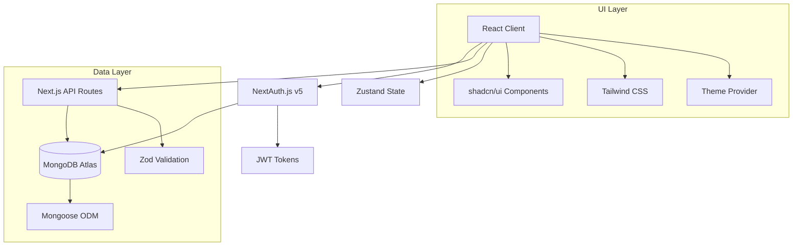
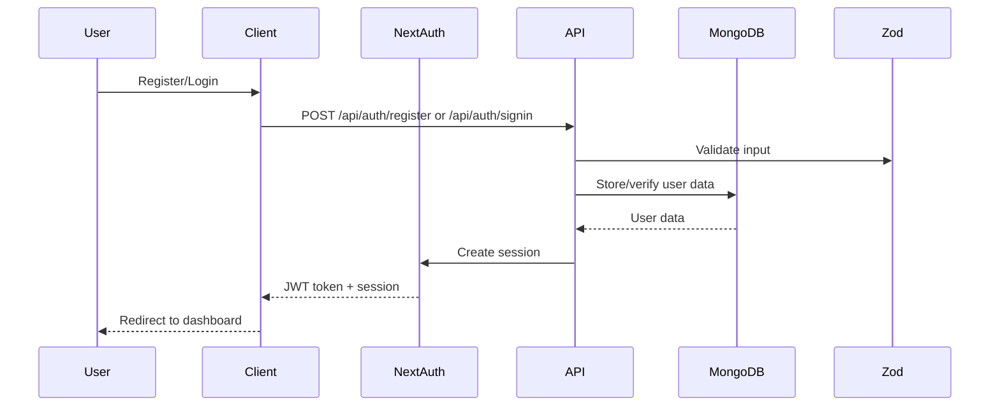

# Design Document

## Overview

The user authentication system provides secure user registration, login, and profile management for the D&D Encounter Tracker Web App. Built on Next.js 15 with TypeScript, the system uses NextAuth.js v5 for authentication, MongoDB for data persistence, and shadcn/ui for a modern, accessible interface with light/dark theme support.

The design prioritizes simplicity for the initial phase while establishing a foundation that can scale to support the full freemium subscription model and advanced D&D features outlined in the product requirements.

## Architecture

### High-Level Architecture



### Authentication Flow



## Components and Interfaces

### Core Components

#### 1. Authentication Pages

**Registration Page (`/register`)**

- Form with first name, last name, email, password, confirm password fields
- Real-time validation using React Hook Form + Zod
- shadcn/ui Form components with consistent styling
- Theme-aware design with proper contrast ratios

**Login Page (`/login`)**

- Email and password fields
- "Forgot Password" link
- "Remember me" option
- Redirect to dashboard on successful authentication

**Profile Page (`/profile`)**

- Display and edit user information (first name, last name, email)
- Password change functionality
- Subscription tier display
- Usage limits visualization
- Theme toggle component

#### 2. UI Components

**ThemeProvider**

```typescript
interface ThemeContextType {
  theme: "light" | "dark" | "system";
  setTheme: (theme: "light" | "dark" | "system") => void;
}
```

**AuthGuard Component**

```typescript
interface AuthGuardProps {
  children: React.ReactNode;
  redirectTo?: string;
  requireAuth?: boolean;
}
```

**UserMenu Component**

- Profile access
- Theme toggle
- Logout functionality
- Subscription status indicator

#### 3. Form Components

All forms use shadcn/ui components with consistent validation styling:

- `<Form>` wrapper with React Hook Form integration
- `<FormField>` with proper error handling
- `<Input>` components with validation states
- `<Button>` components with loading states

### API Interfaces

#### Authentication Endpoints

**POST /api/auth/register**

```typescript
interface RegisterRequest {
  firstName: string;
  lastName: string;
  email: string;
  password: string;
  confirmPassword: string;
}

interface RegisterResponse {
  success: boolean;
  user?: UserProfile;
  error?: string;
}
```

**POST /api/auth/signin**

```typescript
interface SignInRequest {
  email: string;
  password: string;
}
```

**GET /api/user/profile**

```typescript
interface UserProfile {
  id: string;
  firstName: string;
  lastName: string;
  email: string;
  subscriptionTier: "free" | "seasoned" | "expert" | "master" | "guild";
  createdAt: Date;
  updatedAt: Date;
}
```

**PUT /api/user/profile**

```typescript
interface UpdateProfileRequest {
  firstName?: string;
  lastName?: string;
  email?: string;
}
```

**PUT /api/user/password**

```typescript
interface ChangePasswordRequest {
  currentPassword: string;
  newPassword: string;
}
```

## Data Models

### User Schema (Mongoose)

```typescript
interface IUser extends Document {
  firstName: string;
  lastName: string;
  email: string;
  password: string;
  subscriptionTier: "free" | "seasoned" | "expert" | "master" | "guild";
  usageStats: {
    parties: number;
    encounters: number;
    creatures: number;
  };
  preferences: {
    theme: "light" | "dark" | "system";
  };
  createdAt: Date;
  updatedAt: Date;
}

const UserSchema = new Schema<IUser>(
  {
    firstName: { type: String, required: true, trim: true, maxlength: 50 },
    lastName: { type: String, required: true, trim: true, maxlength: 50 },
    email: {
      type: String,
      required: true,
      unique: true,
      lowercase: true,
      validate: [validator.isEmail, "Invalid email address"],
    },
    password: { type: String, required: true, minlength: 8 },
    subscriptionTier: {
      type: String,
      enum: ["free", "seasoned", "expert", "master", "guild"],
      default: "free",
    },
    usageStats: {
      parties: { type: Number, default: 0 },
      encounters: { type: Number, default: 0 },
      creatures: { type: Number, default: 0 },
    },
    preferences: {
      theme: {
        type: String,
        enum: ["light", "dark", "system"],
        default: "system",
      },
    },
  },
  {
    timestamps: true,
  }
);
```

### Session Management

NextAuth.js v5 handles session management with MongoDB adapter:

- JWT tokens for stateless authentication
- Database sessions for enhanced security
- Automatic token refresh
- Secure httpOnly cookies

## Error Handling

### Client-Side Error Handling

**Form Validation Errors**

- Real-time validation using Zod schemas
- Field-level error messages with shadcn/ui styling
- Form-level error summary for accessibility

**Authentication Errors**

- Generic error messages to prevent user enumeration
- Toast notifications for system errors
- Proper error boundaries for component failures

**Network Errors**

- Retry mechanisms for transient failures
- Offline detection and graceful degradation
- Loading states during API calls

### Server-Side Error Handling

**API Route Error Handling**

```typescript
interface APIError {
  code: string;
  message: string;
  statusCode: number;
}

const errorHandler = (error: Error, req: NextRequest) => {
  if (error instanceof ValidationError) {
    return NextResponse.json(
      { error: "Invalid input data", details: error.errors },
      { status: 400 }
    );
  }

  if (error instanceof AuthenticationError) {
    return NextResponse.json(
      { error: "Authentication failed" },
      { status: 401 }
    );
  }

  // Log error for monitoring
  console.error("API Error:", error);

  return NextResponse.json({ error: "Internal server error" }, { status: 500 });
};
```

**Database Error Handling**

- Connection retry logic
- Graceful degradation for database unavailability
- Data validation at schema level
- Duplicate key error handling

## Testing Strategy

### Unit Testing

**Component Testing**

- React Testing Library for component behavior
- Jest for utility functions and hooks
- Mock NextAuth.js for authentication testing
- Test both light and dark theme rendering

**API Testing**

- Jest for API route testing
- Mock MongoDB operations
- Test validation schemas
- Test error handling scenarios

### Integration Testing

**Authentication Flow Testing**

- End-to-end registration process
- Login/logout functionality
- Session persistence
- Password reset flow

**Database Integration**

- MongoDB connection testing
- Schema validation testing
- Data persistence verification

### E2E Testing

**Playwright Tests**

- Complete user registration flow
- Login and profile management
- Theme switching functionality
- Responsive design testing
- Accessibility testing

### Testing Structure

```
tests/
├── unit/
│   ├── components/
│   │   ├── auth/
│   │   └── ui/
│   ├── lib/
│   └── api/
├── integration/
│   ├── auth.test.ts
│   └── database.test.ts
└── e2e/
    ├── registration.spec.ts
    ├── login.spec.ts
    └── profile.spec.ts
```

## Security Considerations

### Password Security

- bcrypt hashing with salt rounds ≥ 12
- Password strength requirements (minimum 8 characters)
- Secure password reset tokens with expiration

### Session Security

- Secure, httpOnly cookies
- CSRF protection via NextAuth.js
- Session timeout and refresh token rotation
- Rate limiting on authentication endpoints

### Data Protection

- Input validation and sanitization
- SQL injection prevention via Mongoose
- XSS protection through React's built-in escaping
- HTTPS enforcement in production

### Privacy Compliance

- Minimal data collection
- User data export capability
- Account deletion functionality
- Audit logging for data access

## Performance Optimization

### Client-Side Performance

- Code splitting for authentication routes
- Lazy loading of profile components
- Optimized bundle size with tree shaking
- Image optimization for avatars (future feature)

### Server-Side Performance

- Database connection pooling
- Query optimization with proper indexing
- Caching strategies for user sessions
- Edge runtime for API routes where applicable

### Database Optimization

- Indexes on email field for fast lookups
- Connection pooling for concurrent requests
- Query optimization for user profile retrieval
- Proper schema design for future scalability

## Deployment and Infrastructure

### Environment Configuration

- Development, staging, and production environments
- Environment-specific MongoDB connections
- Secure environment variable management
- NextAuth.js configuration per environment

### Database Setup

- MongoDB Atlas cluster configuration
- Backup and recovery procedures
- Monitoring and alerting setup
- Connection string security

### Monitoring and Logging

- Error tracking with Sentry integration
- Performance monitoring with Vercel Analytics
- Authentication event logging
- Database performance monitoring
