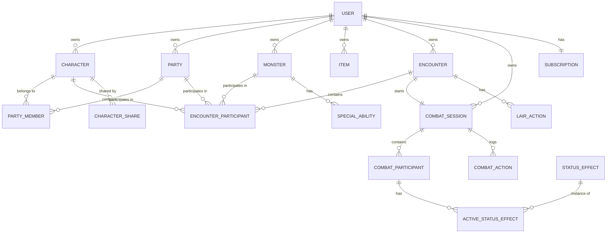

# D&D Tracker - MongoDB Database Design

**Version**: 1.0
**Date**: 2025-11-01
**Database**: MongoDB 8.0+

## 1. Database Architecture



## 2. Collection Schemas

### 2.1 users Collection

```javascript
{
  _id: ObjectId,
  clerkId: String,           // Unique, indexed
  email: String,              // Unique, indexed
  name: String,
  imageUrl: String,
  
  profile: {
    experienceLevel: String,  // enum: ['beginner', 'intermediate', 'expert', 'forever_dm']
    preferredRole: String,    // enum: ['player', 'dm', 'both']
    ruleset: String,          // enum: ['5e', '3.5e', 'pathfinder', 'homebrew']
    bio: String,
    timezone: String,
    language: String,         // default: 'en'
    setupCompleted: Boolean,  // default: false
    setupSkipped: Boolean,    // default: false
    createdAt: Date,
    updatedAt: Date
  },
  
  subscription: {
    tier: String,             // enum: ['free', 'seasoned', 'expert', 'master', 'guild']
    status: String,           // enum: ['active', 'canceled', 'past_due', 'trialing']
    stripeCustomerId: String,
    stripeSubscriptionId: String,
    currentPeriodStart: Date,
    currentPeriodEnd: Date,
    trialEnd: Date,
    cancelAt: Date
  },
  
  usage: {
    parties: Number,          // Current count
    encounters: Number,       // Current count
    characters: Number,       // Current count
    monsters: Number,         // Current count
    items: Number,           // Current count
    combatSessions: Number,   // Current count
    lastUpdated: Date
  },
  
  preferences: {
    theme: String,            // enum: ['light', 'dark', 'auto']
    colorScheme: String,      // Custom color hex
    fontSize: String,         // enum: ['small', 'medium', 'large']
    compactMode: Boolean,
    notifications: {
      email: Boolean,
      combat: Boolean,
      updates: Boolean
    }
  },
  
  metadata: {
    lastLogin: Date,
    loginCount: Number,
    createdAt: Date,
    updatedAt: Date,
    deletedAt: Date          // Soft delete
  }
}

// Indexes
db.users.createIndex({ clerkId: 1 }, { unique: true })
db.users.createIndex({ email: 1 }, { unique: true })
db.users.createIndex({ "subscription.tier": 1, "subscription.status": 1 })
db.users.createIndex({ "metadata.createdAt": -1 })
```

### 2.2 characters Collection

```javascript
{
  _id: ObjectId,
  userId: ObjectId,           // Reference to users._id, indexed
  
  // Basic Info
  name: String,               // Required
  race: String,               // e.g., 'Human', 'Elf', 'Dwarf'
  classes: [{
    className: String,        // e.g., 'Fighter', 'Wizard'
    level: Number,           // 1-20
    subclass: String         // Optional, e.g., 'Battle Master'
  }],
  alignment: String,          // e.g., 'Lawful Good'
  background: String,         // e.g., 'Soldier'
  
  // Stats
  level: Number,              // Total character level
  experiencePoints: Number,
  
  abilityScores: {
    strength: Number,         // 1-30
    dexterity: Number,
    constitution: Number,
    intelligence: Number,
    wisdom: Number,
    charisma: Number
  },
  
  // Combat Stats
  armorClass: Number,         // AC
  initiative: Number,         // Initiative modifier
  speed: Number,              // Movement speed in feet
  
  hitPoints: {
    current: Number,
    maximum: Number,
    temporary: Number,
    hitDice: String,          // e.g., "5d8"
    deathSaves: {
      successes: Number,      // 0-3
      failures: Number        // 0-3
    }
  },
  
  // Proficiencies
  proficiencyBonus: Number,   // Based on level
  savingThrows: {
    strength: { proficient: Boolean, modifier: Number },
    dexterity: { proficient: Boolean, modifier: Number },
    constitution: { proficient: Boolean, modifier: Number },
    intelligence: { proficient: Boolean, modifier: Number },
    wisdom: { proficient: Boolean, modifier: Number },
    charisma: { proficient: Boolean, modifier: Number }
  },
  
  skills: [{
    name: String,             // e.g., 'Acrobatics'
    ability: String,          // e.g., 'dexterity'
    proficient: Boolean,
    expertise: Boolean,
    modifier: Number
  }],
  
  // Equipment
  equipment: [{
    name: String,
    type: String,             // 'weapon', 'armor', 'item'
    quantity: Number,
    equipped: Boolean,
    magical: Boolean,
    description: String
  }],
  
  // Features & Traits
  features: [{
    name: String,
    source: String,           // 'race', 'class', 'feat'
    level: Number,            // Level gained
    description: String
  }],
  
  // Spellcasting (optional)
  spellcasting: {
    ability: String,          // 'intelligence', 'wisdom', 'charisma'
    spellSaveDC: Number,
    spellAttackBonus: Number,
    
    spellSlots: {
      level1: { total: Number, used: Number },
      level2: { total: Number, used: Number },
      level3: { total: Number, used: Number },
      level4: { total: Number, used: Number },
      level5: { total: Number, used: Number },
      level6: { total: Number, used: Number },
      level7: { total: Number, used: Number },
      level8: { total: Number, used: Number },
      level9: { total: Number, used: Number }
    },
    
    knownSpells: [{
      name: String,
      level: Number,
      school: String,
      prepared: Boolean
    }]
  },
  
  // Metadata
  isTemplate: Boolean,        // Can be used as template
  templateName: String,       // If template, display name
  
  notes: String,              // Player/DM notes
  imageUrl: String,           // Character portrait
  
  metadata: {
    createdAt: Date,
    updatedAt: Date,
    lastPlayedAt: Date,
    playCount: Number,
    deletedAt: Date          // Soft delete
  }
}

// Indexes
db.characters.createIndex({ userId: 1, "metadata.createdAt": -1 })
db.characters.createIndex({ userId: 1, name: 1 })
db.characters.createIndex({ isTemplate: 1 })
db.characters.createIndex({ "metadata.deletedAt": 1 })
```

### 2.3 monsters Collection

```javascript
{
  _id: ObjectId,
  userId: ObjectId,           // Owner, indexed
  
  // Basic Info
  name: String,               // Required
  size: String,               // 'Tiny', 'Small', 'Medium', 'Large', 'Huge', 'Gargantuan'
  type: String,               // 'Aberration', 'Beast', 'Celestial', etc.
  subtype: String,            // Optional, e.g., 'goblinoid'
  alignment: String,
  
  // Stats
  challengeRating: Number,    // CR, can be decimal (0.125, 0.25, 0.5, etc.)
  experiencePoints: Number,
  
  armorClass: {
    value: Number,
    type: String              // e.g., 'natural armor', 'leather armor'
  },
  
  hitPoints: {
    average: Number,
    formula: String           // e.g., "8d10 + 16"
  },
  
  speed: {
    walk: Number,
    swim: Number,
    fly: Number,
    climb: Number,
    burrow: Number
  },
  
  abilityScores: {
    strength: Number,
    dexterity: Number,
    constitution: Number,
    intelligence: Number,
    wisdom: Number,
    charisma: Number
  },
  
  // Modifiers
  savingThrows: {
    strength: Number,
    dexterity: Number,
    constitution: Number,
    intelligence: Number,
    wisdom: Number,
    charisma: Number
  },
  
  skills: [{
    name: String,
    modifier: Number
  }],
  
  // Resistances & Immunities
  damageResistances: [String],
  damageImmunities: [String],
  damageVulnerabilities: [String],
  conditionImmunities: [String],
  
  // Senses
  senses: {
    blindsight: Number,
    darkvision: Number,
    tremorsense: Number,
    truesight: Number,
    passivePerception: Number
  },
  
  languages: [String],
  
  // Abilities
  specialAbilities: [{
    name: String,
    description: String,
    recharge: String          // e.g., "Recharge 5-6", "1/Day"
  }],
  
  actions: [{
    name: String,
    type: String,             // 'action', 'bonus_action', 'reaction'
    description: String,
    attackBonus: Number,
    damage: [{
      formula: String,        // e.g., "2d6 + 3"
      type: String           // e.g., "slashing"
    }],
    save: {
      ability: String,
      dc: Number,
      effect: String
    }
  }],
  
  legendaryActions: {
    count: Number,            // Actions per round
    actions: [{
      name: String,
      cost: Number,           // Action cost (usually 1-3)
      description: String
    }]
  },
  
  lairActions: [{
    name: String,
    description: String,
    initiative: Number        // Usually 20
  }],
  
  // Metadata
  source: String,             // 'custom', 'srd', 'module_name'
  isTemplate: Boolean,
  notes: String,
  imageUrl: String,
  
  metadata: {
    createdAt: Date,
    updatedAt: Date,
    usageCount: Number,
    deletedAt: Date
  }
}

// Indexes
db.monsters.createIndex({ userId: 1, challengeRating: 1 })
db.monsters.createIndex({ userId: 1, name: 1 })
db.monsters.createIndex({ userId: 1, type: 1 })
db.monsters.createIndex({ isTemplate: 1 })
```

### 2.4 parties Collection

```javascript
{
  _id: ObjectId,
  userId: ObjectId,           // Owner
  
  name: String,               // Required
  description: String,
  campaignName: String,       // Optional campaign association
  
  members: [{
    characterId: ObjectId,    // Reference to characters._id
    characterName: String,    // Denormalized for performance
    playerName: String,       // Real player name
    role: String,            // 'tank', 'healer', 'dps', 'support', 'utility'
    joinedAt: Date,
    isActive: Boolean,
    notes: String
  }],
  
  stats: {
    memberCount: Number,
    averageLevel: Number,
    totalLevel: Number,
    lastSessionDate: Date,
    sessionCount: Number
  },
  
  metadata: {
    createdAt: Date,
    updatedAt: Date,
    deletedAt: Date
  }
}

// Indexes
db.parties.createIndex({ userId: 1, "metadata.createdAt": -1 })
db.parties.createIndex({ userId: 1, name: 1 })
db.parties.createIndex({ "members.characterId": 1 })
```

### 2.5 items Collection

```javascript
{
  _id: ObjectId,
  userId: ObjectId,
  
  name: String,
  category: String,           // 'weapon', 'armor', 'potion', 'scroll', 'wondrous'
  rarity: String,            // 'common', 'uncommon', 'rare', 'very_rare', 'legendary', 'artifact'
  
  properties: {
    magical: Boolean,
    attunement: Boolean,
    cursed: Boolean,
    consumable: Boolean,
    charges: {
      maximum: Number,
      current: Number,
      recharge: String        // e.g., "1d6+1 at dawn"
    }
  },
  
  // Weapon properties
  weapon: {
    type: String,            // 'simple_melee', 'martial_ranged', etc.
    damage: String,          // e.g., "1d8"
    damageType: String,      // 'slashing', 'piercing', etc.
    properties: [String],    // 'finesse', 'versatile', 'thrown', etc.
    range: {
      normal: Number,
      long: Number
    },
    attackBonus: Number,
    damageBonus: Number
  },
  
  // Armor properties  
  armor: {
    type: String,           // 'light', 'medium', 'heavy', 'shield'
    baseAC: Number,
    maxDexBonus: Number,    // null for no limit
    strengthRequirement: Number,
    stealthDisadvantage: Boolean,
    acBonus: Number         // Magical bonus
  },
  
  description: String,
  effects: [String],        // List of magical effects
  value: {
    amount: Number,
    currency: String        // 'cp', 'sp', 'gp', 'pp'
  },
  weight: Number,           // In pounds
  
  metadata: {
    createdAt: Date,
    updatedAt: Date,
    deletedAt: Date
  }
}

// Indexes
db.items.createIndex({ userId: 1, category: 1, rarity: 1 })
db.items.createIndex({ userId: 1, name: 1 })
```

### 2.6 encounters Collection

```javascript
{
  _id: ObjectId,
  userId: ObjectId,
  
  name: String,
  description: String,
  location: String,
  
  difficulty: {
    calculated: String,      // 'easy', 'medium', 'hard', 'deadly'
    totalXP: Number,
    adjustedXP: Number,
    partyThreshold: {
      easy: Number,
      medium: Number,
      hard: Number,
      deadly: Number
    }
  },
  
  participants: [{
    type: String,           // 'party', 'character', 'monster'
    id: ObjectId,           // Reference to party/character/monster
    quantity: Number,       // For monsters, how many
    initiative: Number,     // Pre-rolled initiative (optional)
    
    // Denormalized data for performance
    name: String,
    ac: Number,
    hp: Number,
    cr: Number              // For monsters
  }],
  
  environment: {
    terrain: String,        // 'forest', 'dungeon', 'urban', etc.
    lighting: String,       // 'bright', 'dim', 'darkness'
    weather: String,        // Weather conditions
    hazards: [String]       // Environmental hazards
  },
  
  lairActions: [{
    name: String,
    description: String,
    trigger: String,        // 'initiative_20', 'custom'
    saveType: String,       // If requires save
    saveDC: Number,
    damage: String,         // Damage formula
    effect: String          // Additional effects
  }],
  
  rewards: {
    experiencePoints: Number,
    treasure: [{
      type: String,
      amount: Number,
      description: String
    }],
    items: [ObjectId]       // References to items collection
  },
  
  notes: String,
  isTemplate: Boolean,
  
  metadata: {
    createdAt: Date,
    updatedAt: Date,
    lastUsedAt: Date,
    useCount: Number,
    deletedAt: Date
  }
}

// Indexes
db.encounters.createIndex({ userId: 1, "metadata.createdAt": -1 })
db.encounters.createIndex({ userId: 1, "difficulty.calculated": 1 })
db.encounters.createIndex({ isTemplate: 1 })
```

### 2.7 combatSessions Collection

```javascript
{
  _id: ObjectId,
  userId: ObjectId,
  encounterId: ObjectId,     // Reference to encounter
  
  status: String,           // 'active', 'paused', 'completed'
  
  round: Number,            // Current round
  turn: Number,             // Current turn index
  
  participants: [{
    id: String,             // Unique participant ID for this combat
    sourceId: ObjectId,     // Reference to character/monster
    type: String,           // 'character', 'monster'
    name: String,
    
    initiative: {
      roll: Number,
      modifier: Number,
      total: Number,
      tiebreaker: Number    // Dexterity score
    },
    
    hitPoints: {
      current: Number,
      maximum: Number,
      temporary: Number
    },
    
    armorClass: Number,
    
    conditions: [{
      effectId: ObjectId,   // Reference to statusEffects
      name: String,
      duration: {
        type: String,       // 'rounds', 'minutes', 'hours', 'until_save'
        remaining: Number
      },
      appliedAt: {
        round: Number,
        turn: Number
      },
      source: String        // Who applied it
    }],
    
    resources: {
      spellSlots: Object,   // Current spell slots
      abilities: [{
        name: String,
        used: Boolean,
        recharge: String
      }],
      legendaryActions: {
        used: Number,
        max: Number
      }
    },
    
    stats: {
      damageDealt: Number,
      damageTaken: Number,
      healingDone: Number,
      healingReceived: Number,
      attacksHit: Number,
      attacksMissed: Number,
      savesSucceeded: Number,
      savesFailed: Number
    },
    
    isConscious: Boolean,
    isDead: Boolean,
    hasActed: Boolean       // This turn
  }],
  
  lairActionUsed: Boolean,   // This round
  
  history: [{
    round: Number,
    turn: Number,
    timestamp: Date,
    action: String,         // 'damage', 'heal', 'condition', 'death', etc.
    actor: String,          // Participant ID
    target: String,         // Participant ID
    details: Object         // Flexible action details
  }],
  
  startedAt: Date,
  pausedAt: Date,
  completedAt: Date,
  duration: Number,         // In seconds
  
  metadata: {
    createdAt: Date,
    updatedAt: Date
  }
}

// Indexes
db.combatSessions.createIndex({ userId: 1, status: 1 })
db.combatSessions.createIndex({ userId: 1, encounterId: 1 })
db.combatSessions.createIndex({ startedAt: -1 })
```

### 2.8 statusEffects Collection (Reference Data)

```javascript
{
  _id: ObjectId,
  
  name: String,             // e.g., 'Poisoned', 'Stunned'
  type: String,             // 'condition', 'spell', 'ability'
  source: String,           // 'srd', 'custom'
  
  description: String,
  
  effects: [{
    type: String,          // 'advantage', 'disadvantage', 'immunity', etc.
    target: String,        // What it affects
    value: Mixed           // Effect value
  }],
  
  duration: {
    defaultType: String,   // 'rounds', 'minutes', 'concentration'
    defaultValue: Number
  },
  
  endConditions: [String], // 'save_ends', 'short_rest', 'long_rest'
  
  gameRules: String,       // Full rules text
  
  metadata: {
    isCore: Boolean,       // Core D&D 5e condition
    createdAt: Date,
    updatedAt: Date
  }
}

// This is mostly static reference data
db.statusEffects.createIndex({ name: 1 })
db.statusEffects.createIndex({ type: 1 })
```

### 2.9 characterShares Collection

```javascript
{
  _id: ObjectId,
  
  characterId: ObjectId,    // Reference to character
  ownerId: ObjectId,        // Original owner
  sharedWithUserId: ObjectId, // User who has access (null for link shares)
  
  shareType: String,        // 'link', 'user'
  shareCode: String,        // Unique code for link shares
  
  permissions: {
    view: Boolean,          // Can view character
    edit: Boolean,          // Can edit character
    play: Boolean,          // Can use in combat
    share: Boolean          // Can share with others
  },
  
  expiresAt: Date,          // Optional expiration
  
  metadata: {
    createdAt: Date,
    acceptedAt: Date,       // When share was accepted
    lastAccessedAt: Date,
    accessCount: Number
  }
}

// Indexes
db.characterShares.createIndex({ characterId: 1, sharedWithUserId: 1 })
db.characterShares.createIndex({ shareCode: 1 }, { unique: true, sparse: true })
db.characterShares.createIndex({ ownerId: 1 })
db.characterShares.createIndex({ sharedWithUserId: 1 })
```

### 2.10 subscriptions Collection

```javascript
{
  _id: ObjectId,
  userId: ObjectId,         // Reference to user
  
  stripeCustomerId: String,
  stripeSubscriptionId: String,
  
  tier: String,            // 'free', 'seasoned', 'expert', 'master', 'guild'
  status: String,          // 'active', 'canceled', 'past_due', 'trialing'
  
  billing: {
    interval: String,      // 'month', 'year'
    amount: Number,        // In cents
    currency: String,      // 'usd'
    nextBillingDate: Date,
    lastBillingDate: Date
  },
  
  limits: {
    parties: Number,
    encounters: Number,
    characters: Number,
    monsters: Number,
    maxParticipants: Number,
    features: [String]     // Enabled feature flags
  },
  
  history: [{
    event: String,         // 'created', 'upgraded', 'downgraded', 'canceled'
    fromTier: String,
    toTier: String,
    timestamp: Date,
    metadata: Object
  }],
  
  trial: {
    isActive: Boolean,
    startDate: Date,
    endDate: Date,
    converted: Boolean
  },
  
  metadata: {
    createdAt: Date,
    updatedAt: Date,
    canceledAt: Date,
    cancelReason: String
  }
}

// Indexes
db.subscriptions.createIndex({ userId: 1 }, { unique: true })
db.subscriptions.createIndex({ stripeCustomerId: 1 })
db.subscriptions.createIndex({ stripeSubscriptionId: 1 })
db.subscriptions.createIndex({ status: 1, tier: 1 })
```

### 2.11 testimonials Collection

```javascript
{
  _id: ObjectId,
  
  author: {
    name: String,
    title: String,         // e.g., "DM for 5 years"
    imageUrl: String
  },
  
  content: String,
  rating: Number,          // 1-5 stars
  
  highlight: String,       // Short quote for headlines
  
  display: {
    featured: Boolean,     // Show on landing page
    position: Number,      // Display order
    category: String       // 'new_dm', 'experienced', 'professional'
  },
  
  metadata: {
    approved: Boolean,
    approvedBy: ObjectId,
    approvedAt: Date,
    createdAt: Date,
    updatedAt: Date
  }
}

// Indexes
db.testimonials.createIndex({ "display.featured": 1, "display.position": 1 })
db.testimonials.createIndex({ "metadata.approved": 1 })
```

## 3. Data Relationships

### 3.1 Ownership Hierarchy

```
User
├── Characters
├── Monsters  
├── Items
├── Parties
│   └── Party Members (Characters)
├── Encounters
│   └── Participants (Parties/Characters/Monsters)
└── Combat Sessions
    └── Combat Participants
```

### 3.2 Reference Relationships

- **Soft References**: Store both ID and denormalized data
- **Hard References**: Store only ID, lookup required
- **Embedded**: Data stored directly in parent document

### 3.3 Denormalization Strategy

- Character names in party members
- Participant stats in encounters
- Combat stats in combat sessions
- User limits cached in user document

## 4. Indexes Strategy

### 4.1 Primary Indexes

- All `_id` fields (automatic)
- User lookups: `clerkId`, `email`
- Ownership: `userId` on all collections

### 4.2 Query Optimization Indexes

- Compound indexes for common queries
- Sort indexes for list views
- Text indexes for search functionality

### 4.3 Performance Indexes

```javascript
// Most common query patterns
db.characters.createIndex({ userId: 1, "metadata.createdAt": -1 })
db.combatSessions.createIndex({ userId: 1, status: 1 })
db.encounters.createIndex({ userId: 1, "difficulty.calculated": 1 })
```

## 5. Data Migration Strategy

### 5.1 Schema Versioning

```javascript
{
  _id: ObjectId,
  schemaVersion: 1,        // Track schema version per document
  // ... rest of document
}
```

### 5.2 Migration Approach

1. **Backward Compatible**: New fields optional
2. **Lazy Migration**: Update on document access
3. **Batch Migration**: Background jobs for bulk updates
4. **Version Coexistence**: Support multiple versions

## 6. Backup & Recovery

### 6.1 Backup Strategy

- **Continuous**: MongoDB Atlas continuous backup
- **Daily Snapshots**: Point-in-time recovery
- **Export**: User data export functionality

### 6.2 Recovery Procedures

```bash
# Point-in-time recovery
mongorestore --uri="mongodb+srv://..." --time="2025-11-01T10:00:00"

# Selective restore
mongorestore --uri="mongodb+srv://..." --nsInclude="dndtracker.users"
```

## 7. Security Considerations

### 7.1 Field-Level Encryption

```javascript
// Sensitive fields encrypted at rest
{
  email: { $encrypt: "user@example.com" },
  stripeCustomerId: { $encrypt: "cus_xxx" }
}
```

### 7.2 Access Control

- Database user with minimal permissions
- Read-only replicas for analytics
- IP whitelist for production access

## 8. Performance Optimizations

### 8.1 Document Size Limits

- Max document size: 16MB
- Combat history limited to last 100 actions
- Embedded arrays capped at reasonable limits

### 8.2 Query Patterns

```javascript
// Efficient pagination
db.characters.find({ userId: userId })
  .sort({ "metadata.createdAt": -1 })
  .limit(20)
  .skip(page * 20)

// Projection for large documents
db.combatSessions.findOne(
  { _id: sessionId },
  { history: 0 }  // Exclude large history array
)
```

### 8.3 Aggregation Pipelines

```javascript
// Dashboard statistics
db.users.aggregate([
  { $match: { _id: userId } },
  { $lookup: {
    from: "characters",
    localField: "_id",
    foreignField: "userId",
    as: "characters"
  }},
  { $project: {
    characterCount: { $size: "$characters" },
    subscription: 1,
    usage: 1
  }}
])
```

## 9. Data Retention Policies

### 9.1 Active Data

- No automatic deletion
- Soft delete with `deletedAt` timestamp

### 9.2 Inactive Data

- Combat sessions: Archive after 90 days
- Unused templates: Flag after 180 days

### 9.3 User Deletion

- GDPR compliant deletion
- Cascade delete all user data
- 30-day recovery window

## 10. Monitoring & Maintenance

### 10.1 Key Metrics

- Collection sizes
- Index usage statistics  
- Query performance
- Document growth rate

### 10.2 Maintenance Tasks

```javascript
// Regular maintenance
db.combatSessions.remove({ 
  status: "completed",
  completedAt: { $lt: new Date(Date.now() - 90*24*60*60*1000) }
})

// Index optimization
db.characters.reIndex()

// Collection statistics
db.characters.stats()
```
