# D&D Tracker - High-Level Technical Design

**Version**: 1.0
**Date**: 2025-11-01
**Status**: Design Phase

This document operationalizes the scope defined in `docs/Product-Requirements.md` and the delivery plan in `docs/Feature-Roadmap.md`. Runtime and dependency lifecycles follow `docs/Tech-Stack.md`.

## 1. System Architecture Overview

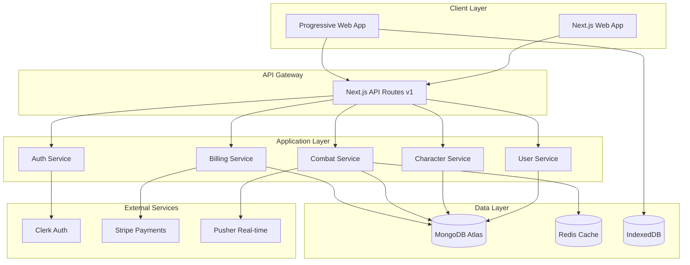

## 2. Component Architecture

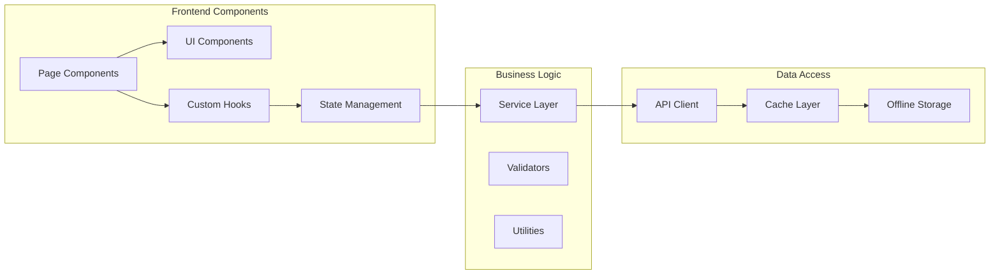

## 3. Authentication Flow

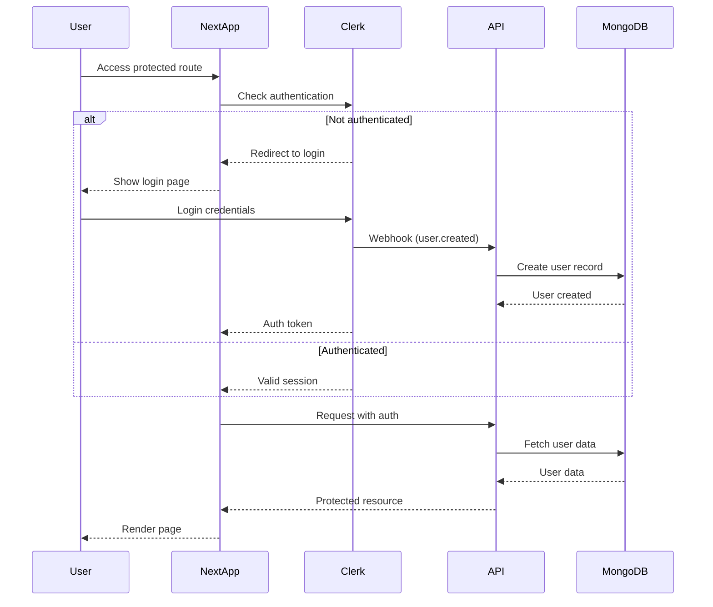

Alignment: PRD §4.1 (User Management & Authentication).

## 4. Combat Session State Machine

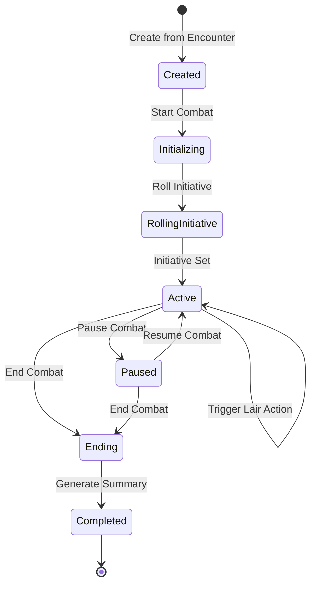

Alignment: PRD §4.5 (Combat Flow Requirements).

## 5. Data Flow Architecture

```mermaid
graph TD
    subgraph "Write Path"
        CLIENT[Client Action]
        VALIDATE[Validate Input]
        AUTHORIZE[Check Permissions]
        LIMITS[Check Tier Limits]
        WRITE[Write to MongoDB]
        CACHE_INV[Invalidate Cache]
        WEBHOOK[Send Webhooks]
        RESPONSE[Return Response]
    end
    
    CLIENT --> VALIDATE
    VALIDATE --> AUTHORIZE
    AUTHORIZE --> LIMITS
    LIMITS --> WRITE
    WRITE --> CACHE_INV
    CACHE_INV --> WEBHOOK
    WEBHOOK --> RESPONSE
    
    subgraph "Read Path"
        REQUEST[Client Request]
        CACHE_CHECK[Check Cache]
        CACHE_HIT[Cache Hit]
        CACHE_MISS[Cache Miss]
        DB_READ[Read MongoDB]
        CACHE_SET[Update Cache]
        RETURN[Return Data]
    end
    
    REQUEST --> CACHE_CHECK
    CACHE_CHECK --> CACHE_HIT
    CACHE_CHECK --> CACHE_MISS
    CACHE_HIT --> RETURN
    CACHE_MISS --> DB_READ
    DB_READ --> CACHE_SET
    CACHE_SET --> RETURN
```

## 6. Service Layer Design

### 6.1 Service Responsibilities

```typescript
// Service Interface Pattern
interface IService<T> {
  create(data: CreateDTO): Promise<T>
  findById(id: string): Promise<T | null>
  findAll(filters: FilterDTO): Promise<PaginatedResult<T>>
  update(id: string, data: UpdateDTO): Promise<T>
  delete(id: string): Promise<void>
}

// Example: CharacterService
class CharacterService implements IService<Character> {
  constructor(
    private repository: CharacterRepository,
    private validator: CharacterValidator,
    private limiter: TierLimiter
  ) {}
  
  async create(data: CreateCharacterDTO): Promise<Character> {
    await this.validator.validate(data)
    await this.limiter.checkLimit('characters', data.userId)
    return this.repository.create(data)
  }
}
```

### 6.2 Repository Pattern

```typescript
// Repository Interface
interface IRepository<T> {
  create(data: T): Promise<T>
  findById(id: string): Promise<T | null>
  findMany(query: Query): Promise<T[]>
  update(id: string, data: Partial<T>): Promise<T>
  delete(id: string): Promise<void>
}

// MongoDB Implementation
class MongoRepository<T> implements IRepository<T> {
  constructor(private model: Model<T>) {}
  
  async create(data: T): Promise<T> {
    const doc = new this.model(data)
    return doc.save()
  }
}
```

### 6.3 Collaboration Service Extension

Alignment: PRD §§3.3 & 12 (Collaborative Mode & Premium Enhancements).

Responsibilities:

- Manage shared campaign metadata and participant ACLs.
- Coordinate presence indicators via Pusher channels (`campaign:{id}` topics).
- Persist collaborative state changes and audit history for premium users.
- Enforce tier limits defined in `docs/Product-Requirements.md` when sharing resources.

Data Model (MongoDB):

```typescript
interface CollaborationSession {
  campaignId: ObjectId
  ownerUserId: ObjectId
  sharedWith: Array<{
    userId: ObjectId
    role: 'viewer' | 'editor'
    invitedAt: Date
    acceptedAt?: Date
  }>
  presenceChannel: string
  lastActivityAt: Date
  createdAt: Date
  updatedAt: Date
}
```

Service Interface:

```typescript
interface ICollaborationService {
  inviteUser(input: InviteUserDTO): Promise<void>
  revokeAccess(input: RevokeAccessDTO): Promise<void>
  listCollaborators(campaignId: string): Promise<CollaboratorSummary[]>
  publishPresence(event: PresenceEvent): Promise<void>
}
```

Notes:

- Presence events flow through Pusher; offline fallback queues events in IndexedDB (see Phase 4 roadmap increments 030-033).
- Authorization checks recurse through Clerk roles and campaign ACL definitions.

## 7. API Versioning Strategy

```
/api/v1/
├── auth/
│   ├── webhook          # Clerk webhooks
│   └── session          # Session management
├── users/
│   ├── profile          # User profile
│   ├── usage            # Usage metrics
│   └── theme            # Theme preferences
├── characters/
│   ├── templates        # Character templates
│   └── shared           # Shared characters
├── parties/
│   └── members          # Party members
├── monsters/
├── items/
├── encounters/
│   └── participants     # Encounter participants
├── combat/
│   └── sessions/
│       ├── initiative   # Initiative management
│       ├── damage       # HP tracking
│       ├── effects      # Status effects
│       └── lair-actions # Lair actions
├── billing/
│   ├── checkout         # Stripe checkout
│   ├── portal          # Customer portal
│   └── webhooks        # Stripe webhooks
└── export/              # Data export
```

## 8. Caching Strategy

### 8.1 Cache Layers

1. **Browser Cache** (Service Worker)
   - Static assets
   - API responses (GET requests)
   - Offline fallback

2. **Application Cache** (Zustand/React Query)
   - User session
   - Active combat state
   - Character/party lists

3. **Server Cache** (Redis)
   - Session data
   - Frequently accessed entities
   - Combat state for real-time updates

4. **Database Cache** (MongoDB)
   - Query result cache
   - Aggregation pipeline cache

### 8.2 Cache Invalidation

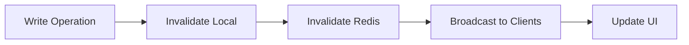

## 9. Error Handling Architecture

```typescript
// Error Classification
enum ErrorType {
  VALIDATION = 'VALIDATION',
  AUTHENTICATION = 'AUTHENTICATION',
  AUTHORIZATION = 'AUTHORIZATION',
  RATE_LIMIT = 'RATE_LIMIT',
  TIER_LIMIT = 'TIER_LIMIT',
  NOT_FOUND = 'NOT_FOUND',
  CONFLICT = 'CONFLICT',
  INTERNAL = 'INTERNAL'
}

// Standard Error Response
interface ErrorResponse {
  error: {
    type: ErrorType
    message: string
    code: string
    details?: Record<string, any>
    timestamp: string
    requestId: string
  }
}

// HTTP Status Mapping
const STATUS_MAP = {
  [ErrorType.VALIDATION]: 400,
  [ErrorType.AUTHENTICATION]: 401,
  [ErrorType.AUTHORIZATION]: 403,
  [ErrorType.RATE_LIMIT]: 429,
  [ErrorType.TIER_LIMIT]: 402,
  [ErrorType.NOT_FOUND]: 404,
  [ErrorType.CONFLICT]: 409,
  [ErrorType.INTERNAL]: 500
}
```

## 10. Security Architecture

### 10.1 Security Layers

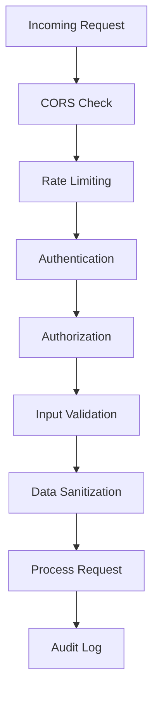

### 10.2 Security Measures

- **Authentication**: Clerk JWT tokens
- **Authorization**: Role-based access control (RBAC)
- **Rate Limiting**: Per-user and per-IP limits
- **Input Validation**: Zod schemas
- **SQL Injection**: N/A (NoSQL with Mongoose)
- **XSS Prevention**: React automatic escaping
- **CSRF Protection**: SameSite cookies
- **HTTPS**: Enforced via Fly.io
- **Secrets Management**: Environment variables

## 11. Performance Optimization

### 11.1 Frontend Optimizations

- **Code Splitting**: Dynamic imports for routes
- **Lazy Loading**: Components and images
- **Bundle Optimization**: Tree shaking, minification
- **Image Optimization**: Next.js Image component
- **Font Optimization**: next/font
- **Prefetching**: Link prefetching for navigation

### 11.2 Backend Optimizations

- **Database Indexing**: Compound indexes for queries
- **Query Optimization**: Projection and aggregation
- **Connection Pooling**: MongoDB connection reuse
- **Pagination**: Cursor-based pagination
- **Batch Operations**: Bulk writes for efficiency
- **Caching**: Multi-level caching strategy

## 12. Monitoring & Observability

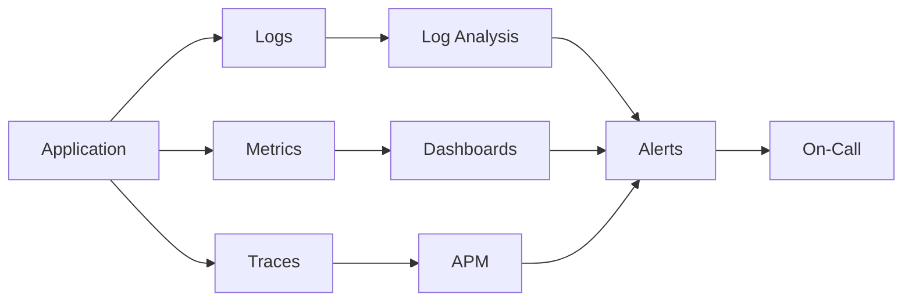

### 12.1 Monitoring Stack

- **Logging**: Structured JSON logs to Fly.io
- **Metrics**: Application metrics, API latency
- **Error Tracking**: Sentry integration
- **APM**: Performance monitoring
- **Uptime**: Health checks every 60s
- **Alerting**: Critical error thresholds

## 13. Deployment Architecture

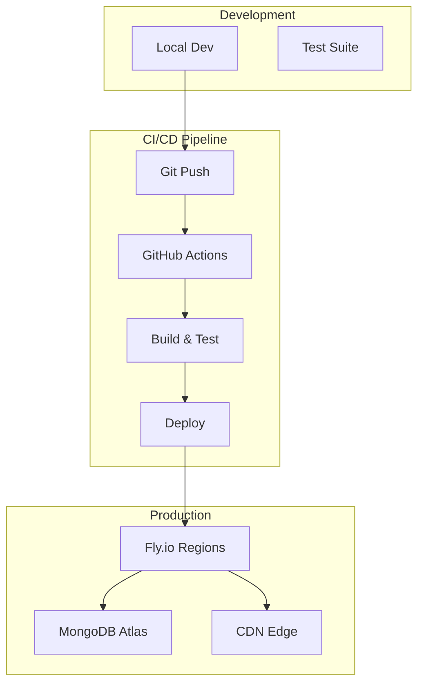

## 14. Scalability Considerations

### 14.1 Horizontal Scaling

- **Stateless API**: No server-side session storage
- **Load Balancing**: Fly.io automatic distribution
- **Database Sharding**: MongoDB auto-sharding
- **Cache Distribution**: Redis cluster ready

### 14.2 Vertical Scaling

- **Resource Limits**: Configurable via Fly.io
- **Connection Pools**: Adjustable pool sizes
- **Worker Threads**: Background job processing
- **Memory Management**: Garbage collection tuning

## 15. Testing Strategy

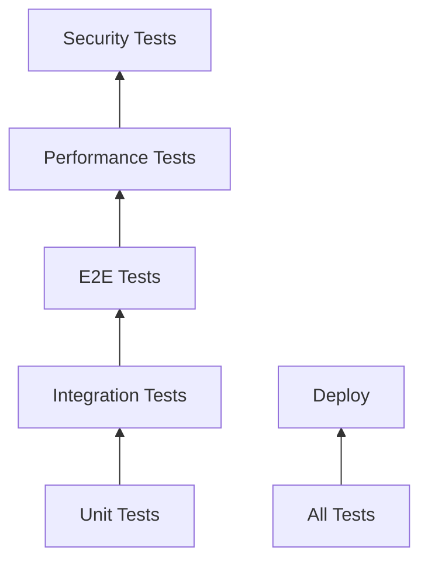

### 15.1 Test Coverage Requirements

- **Unit Tests**: 80% coverage minimum
- **Integration Tests**: All API endpoints
- **E2E Tests**: Critical user journeys
- **Performance Tests**: Load testing for scale
- **Security Tests**: Penetration testing

## 16. Development Workflow

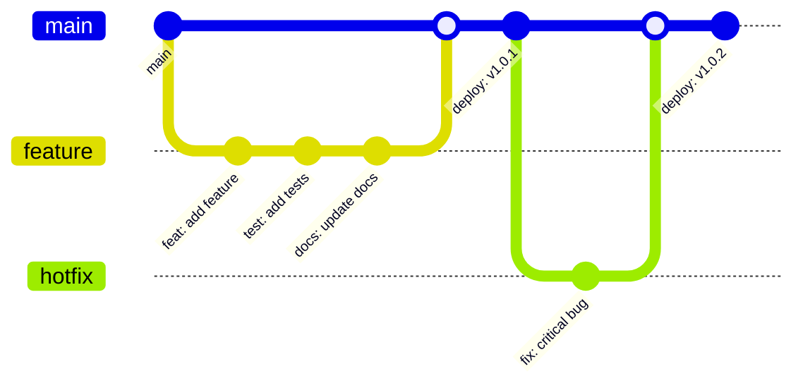

## 17. Tech Stack Summary

Version governance lives in `docs/Tech-Stack.md`; the table below summarizes the primary layers.

| Layer | Technology | Version | Purpose |
|-------|------------|---------|---------|
| Runtime | Node.js | 25.1.0 | Server runtime |
| Framework | Next.js | 16.0.1 | Full-stack framework |
| Language | TypeScript | 5.9.2 | Type safety |
| Database | MongoDB | 8.0+ | Data persistence |
| ODM | Mongoose | 8.19.1 | Data modeling |
| Auth | Clerk | 5.0+ | Authentication |
| Payments | Stripe | 16.0+ | Subscriptions |
| UI | React | 19.2.0 | Component library |
| Styling | Tailwind CSS | 4.x | Utility CSS |
| Components | shadcn/ui | 3.2+ | UI components |
| State | Zustand | 4.5+ | Client state |
| Cache | React Query | 5.0+ | Server state |
| Testing | Jest/Playwright | Latest | Test suite |
| Hosting | Fly.io | - | Cloud platform |

## 18. Disaster Recovery

### 18.1 Backup Strategy

- **Database**: Daily automated backups (30-day retention)
- **Code**: Git version control
- **Secrets**: Secure backup of environment variables
- **User Data**: Export functionality for users

### 18.2 Recovery Procedures

1. **Database Failure**: Restore from MongoDB Atlas backup
2. **Service Outage**: Auto-scaling and region failover
3. **Data Corruption**: Point-in-time recovery
4. **Security Breach**: Incident response plan

## 19. Compliance & Privacy

- **GDPR**: Data export, deletion rights
- **PCI DSS**: Via Stripe (no card data stored)
- **Data Encryption**: TLS 1.3, AES-256
- **Privacy Policy**: Clear data usage terms
- **Cookie Policy**: Consent management

## 20. Future Architecture Considerations

### 20.1 Potential Enhancements

- **GraphQL API**: For flexible data fetching
- **WebSocket**: For real-time combat updates
- **Microservices**: Service decomposition at scale
- **Event Sourcing**: For combat action replay
- **CQRS**: Separate read/write models
- **Mobile Apps**: React Native applications

### 20.2 Technical Debt Management

- **Code Reviews**: Mandatory PR reviews
- **Refactoring**: Scheduled tech debt sprints
- **Documentation**: Kept current with code
- **Dependency Updates**: Monthly security updates
- **Performance Audits**: Quarterly reviews